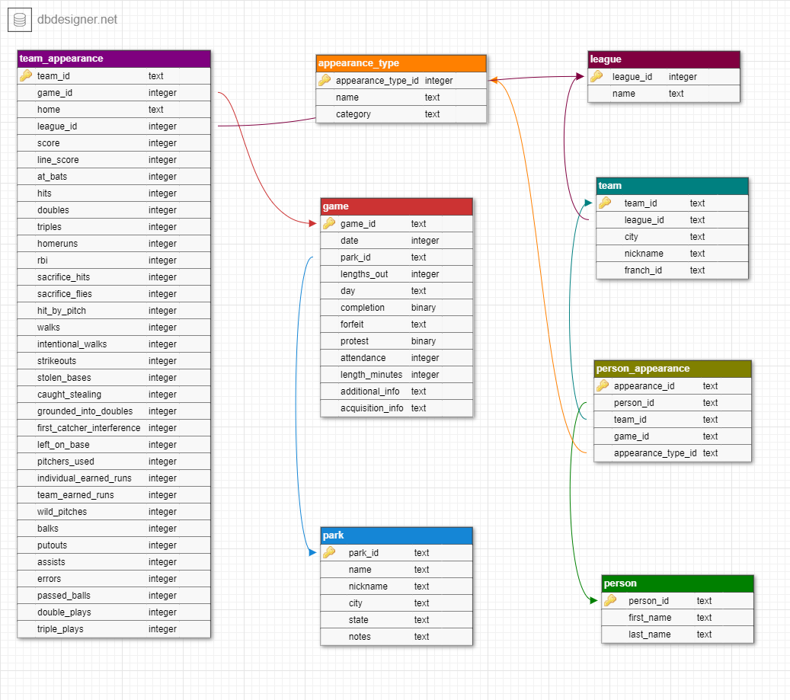

Guided project: Baseball
================
Fredrick Boshe
21/04/2021

This project is about utilizing the power of SQL to create a database
out of several Excel CSV files that exist individually. The goal is to
create a database that will house the several CSV files under one roof.
This includes creating a database Schema, linking the tables with
*primary keys* and *foreign keys*.

As usual, i shall be running my SQL queries on an R markdown book to
allow publishing queries online. A brief introduction on using SQL in R,
the packages and requirements can be found in another project i worked
on [earlier](https://rickyboshe.github.io/projects/Music.html).

This project will look at Baseball, America’s favorite past time. It
looks at game information and stats from a record of over 170,000 games.
The games are are chronologically ordered and occur between 1871 and
2016.

For those unfamiliar with Baseball, it might be useful to spend sometime
time reading up on the key aspects of the game.

For each game we have:

-   general information on the game
-   team level stats for each team
-   a list of players from each team, numbered, with their defensive
    positions
-   the umpires that officiated the game
-   some ‘awards’, like winning and losing pitcher

A game\_log\_fields.txt file that tell us that the player number
corresponds with the order in which they batted.

This projects analyzes data from
[Retrosheet](https://www.retrosheet.org/#).

R code can be used to import CSV files as tables into a database. We
initialize a new/empty database first.

``` r
#'Load data from your working directory into R global environment
##Load the tables into a database
conn <- dbConnect(SQLite(), "mlb.db") #initialize a new database

dbWriteTable(conn=conn, name = "game", value = game, row.names=FALSE, 
             header=TRUE)
dbWriteTable(conn=conn, name = "park", value = park, row.names=FALSE, 
             header=TRUE)
dbWriteTable(conn=conn, name = "people", value = people, row.names=FALSE, 
             header=TRUE)
dbWriteTable(conn=conn, name = "team", value = team, row.names=FALSE, 
             header=TRUE)

#Check if all tables have been added to the database
tables <- dbListTables(conn)
```

## Defensive Positions

You can read up on player defensive positions \[here\]
(<https://baseballcoachinglab.com/baseball-positions/>). The listed
positions are:

-   Pitcher
-   Catcher
-   1st Base
-   2nd Base
-   3rd Base
-   Shortstop
-   Left Field
-   Center Field
-   Right Field


The data uploaded has “10 positions” which might be a mistake by
Retrosheets. They have it listed as position 0. But we do not have
position 0 in our data. Therefore i will leave out this data.

## Leagues

According to Wikipedia, there are two major professional baseball
leagues, the American (AL) and National (NL). The data from retrosheets
contains a total of 6 different leagues. The additional leagues are
mostly defunct leagues from the old days, like the Federal league which
ended in 1915.

-   NL: [National League](https://en.wikipedia.org/wiki/National_League)
-   AL: [American League](https://en.wikipedia.org/wiki/American_League)
-   AA: [American
    Association](https://en.wikipedia.org/wiki/American_Association_%2819th_century%29)
-   FL: [Federal League](https://en.wikipedia.org/wiki/Federal_League)
-   PL: [Players
    League](https://en.wikipedia.org/wiki/Players%27_League)
-   UA: [Union
    Association](https://en.wikipedia.org/wiki/Union_Association)

``` sql
--Preview the tables in the database
SELECT
    name,
    type
FROM sqlite_master
WHERE type IN ("table","view");
```

<div class="knitsql-table">

| name   | type  |
|:-------|:------|
| game   | table |
| park   | table |
| people | table |
| team   | table |

4 records

</div>

We can manipulate the tables within the database. For the game table we
would like to have a unique identifier column for games, “game\_id”.

``` sql
--Create a new column in the game table
ALTER TABLE game
ADD COLUMN game_id TEXT;
```

The unique identifier is a combination of the home team name, the date
of the game played and the number of game. The number of game is
basically if it was a single game, the second game in a double header
etc.

``` sql
--Create fill in rows
UPDATE game
SET game_id = h_name||date||number_of_game;
```

``` sql
--Check if query worked
SELECT game_id, date,
       h_name, number_of_game
FROM game
LIMIT 5;
```

<div class="knitsql-table">

| game\_id         |     date | h\_name | number\_of\_game |
|:-----------------|---------:|:--------|-----------------:|
| FW118710504.00.0 | 18710504 | FW1     |                0 |
| WS318710505.00.0 | 18710505 | WS3     |                0 |
| RC118710506.00.0 | 18710506 | RC1     |                0 |
| CH118710508.00.0 | 18710508 | CH1     |                0 |
| TRO18710509.00.0 | 18710509 | TRO     |                0 |

5 records

</div>

# Normalization

Normalization is the process of restructuring the data to avoid
duplicates, redundancy etc. This makes a database easier to work with.
It can involve splitting of tables, removing of columns and creating new
tables/columns.

There are several opportunities to normalize our data:

-   Game: Columns with player Ids and player names can also be found in
    the *People* table. So we can remove these columns from the *Game*
    table.
-   Game: This table has each team’s player listings (9 players and
    their positions). We can extract this data into a separate table
    that tracks player appearances and their positions.
-   Game: Umpires also exhibit the same issue as players in this table.
    We should extract them and have them in either their own table or
    make one table for players, umpires and managers.
-   Game: There is a repetition for the offensive and defensive stats
    for both home teams and the visiting teams. ideally, we would like
    to remedy this by splitting them into a table lists each game twice,
    one for each team. Then drop the column repetition.
-   Park: We cn reproduce the start and end years using *Game* table. We
    would also like to have a complete state attribute, so we leave it
    as is (i.e. state and city).
-   People: We can reproduce the debut dates using the *Game* table.
-   Team: We can reproduce the start, end and sequence columns using
    *Game* table.

## Database Schema

It helps to jot down a schema for the normalized database. Identify the
primary and foreign keys and how tables relate to each other. I prefer
using the free
[dbdesigner](https://app.dbdesigner.net/designer/schema/guest_template)
tool.

## Database Schema



All the normalization opportunities identified before will be done with
SQL query in the chunks below. Click on the “code” to see more
information and the code.

#### Create person Table

``` sql
--Create Person table
CREATE TABLE person (person_id TEXT PRIMARY KEY,
              first_name TEXT,
              second_name TEXT);
```

``` sql
--Populate person table
INSERT INTO person
SELECT p.id, p.first, p.last 
FROM people as p; 
```

``` sql
--Check if query worked
SELECT *
FROM person
LIMIT 5;
```

<div class="knitsql-table">

| person\_id | first\_name | second\_name |
|:-----------|:------------|:-------------|
| aardd001   | David       | Aardsma      |
| aaroh101   | Hank        | Aaron        |
| aarot101   | Tommie      | Aaron        |
| aased001   | Don         | Aase         |
| abada001   | Andy        | Abad         |

5 records

</div>

#### Create park\_new Table

``` sql
--Create park table
CREATE TABLE park_new (park_id TEXT PRIMARY KEY,
                   name TEXT,
                   nickname TEXT,
                   city TEXT,
                   state TEXT,
                   notes TEXT);
 
```

``` sql
--Populate park table
INSERT INTO park_new
SELECT pk.park_id, pk.name, pk.aka, pk.city, pk.state, pk.notes 
FROM park as pk; 
```

``` sql
--Check if query worked
SELECT *
FROM park_new
LIMIT 5;
```

<div class="knitsql-table">

| park\_id | name                          | nickname                                 | city      | state | notes                                          |
|:---------|:------------------------------|:-----------------------------------------|:----------|:------|:-----------------------------------------------|
| ALB01    | Riverside Park                | NA                                       | Albany    | NY    | TRN:9/11/80;6/15&9/10/1881;5/16-5/18&5/30/1882 |
| ALT01    | Columbia Park                 | NA                                       | Altoona   | PA    | NA                                             |
| ANA01    | Angel Stadium of Anaheim      | Edison Field; Anaheim Stadium            | Anaheim   | CA    | NA                                             |
| ARL01    | Arlington Stadium             | NA                                       | Arlington | TX    | NA                                             |
| ARL02    | Rangers Ballpark in Arlington | The Ballpark in Arlington; Ameriquest Fl | Arlington | TX    | NA                                             |

5 records

</div>

#### Create league Table

``` sql
--Create league table
CREATE TABLE IF NOT EXISTS league (
      league_id TEXT PRIMARY KEY,
      name TEXT); -- If NOT EXIST helps to ensure no duplicates
```

Insert league values i.e. names of the six league IDs. (not present in
any existing table so far)

``` sql
--Populate league table
INSERT INTO league
VALUES("NL", "National League"),
      ("AL", "American League"),
      ("AA", "American Association"),
      ("FL", "Federal League"),
      ("PL", "Players League"),
      ("UA", "Union Association"); 
```

``` sql
--Check if query worked
SELECT *
FROM league
LIMIT 5;
```

<div class="knitsql-table">

| league\_id | name                 |
|:-----------|:---------------------|
| NL         | National League      |
| AL         | American League      |
| AA         | American Association |
| FL         | Federal League       |
| PL         | Players League       |

5 records

</div>

#### Create appearance\_type Table

The data for the table “appearance\_type” exists in a separate csv file.
Import and load values to the table.

``` sql
--Make sure no pre-existing appearance_type table
DROP TABLE IF EXISTS appearance_type; 
```

``` sql
--Check if query worked
SELECT *
FROM appearance_type
LIMIT 5;
```

<div class="knitsql-table">

| appearance\_type\_id | name     | category |
|:---------------------|:---------|:---------|
| O1                   | Batter 1 | offense  |
| O2                   | Batter 2 | offense  |
| O3                   | Batter 3 | offense  |
| O4                   | Batter 4 | offense  |
| O5                   | Batter 5 | offense  |

5 records

</div>

#### Create team\_new Table

``` sql
--Create team_new table
CREATE TABLE team_new (team_id TEXT PRIMARY KEY,
                       league_id TEXT,
                       city TEXT,
                       nickname TEXT,
                       franch_id,
                       FOREIGN KEY (league_id) 
                       REFERENCES league(league_id));
 
```

``` sql
--Populate team_new table
INSERT OR IGNORE INTO team_new --Insert or Ignore helps deal with any duplicates on Primary Key
SELECT t.team_id, t.league, t.city, t.nickname, t.franch_id 
FROM team as t; 
```

``` sql
--Check if query worked
SELECT *
FROM team_new
LIMIT 5;
```

<div class="knitsql-table">

| team\_id | league\_id | city      | nickname        | franch\_id |
|:---------|:-----------|:----------|:----------------|:-----------|
| ALT      | UA         | Altoona   | Mountain Cities | ALT        |
| ARI      | NL         | Arizona   | Diamondbacks    | ARI        |
| BFN      | NL         | Buffalo   | Bisons          | BFN        |
| BFP      | PL         | Buffalo   | Bisons          | BFP        |
| BL1      | NA         | Baltimore | Canaries        | BL1        |

5 records

</div>

#### Create game\_new Table

``` sql
--Create game_new table
CREATE TABLE game_new (game_id TEXT PRIMARY KEY,
                       date INTEGER,
                       number_of_game INTEGER,
                       park_id TEXT,
                       lengths_out INTEGER,
                       day BOOLEAN,
                       completion TEXT,
                       forfeit TEXT,
                       protest TEXT,
                       attendance NUMERIC,
                       lengths_minute NUMERIC,
                       additional_info TEXT,
                       acquisition_info TEXT,
                       FOREIGN KEY (park_id) 
                       REFERENCES park_new(park_id));
 
```

SQLite does not have the “BOOLEAN” data type. We must code the columns
to 1 or 0 before passing them to the table we are creating.

``` sql
--Populate game_new table
INSERT OR IGNORE INTO game_new 
SELECT game_id, date, number_of_game, park_id,length_outs,
CASE
       WHEN day_night = "D" THEN 1
       WHEN day_night = "N" THEN 0
       ELSE NULL
       END
       AS day,
      completion, forfeit, protest, attendance,
      length_minutes, additional_info, acquisition_info
FROM game; 
```

``` sql
--Check if query worked
SELECT *
FROM game_new
LIMIT 5;
```

<div class="knitsql-table">

| game\_id         |     date | number\_of\_game | park\_id | lengths\_out | day | completion | forfeit | protest | attendance | lengths\_minute | additional\_info | acquisition\_info |
|:-----------------|---------:|-----------------:|:---------|-------------:|----:|:-----------|:--------|:--------|-----------:|----------------:|:-----------------|:------------------|
| FW118710504.00.0 | 18710504 |                0 | FOR01    |           54 |   1 | NA         | NA      | NA      |        200 |             120 | NA               | Y                 |
| WS318710505.00.0 | 18710505 |                0 | WAS01    |           54 |   1 | NA         | NA      | NA      |       5000 |             145 | HTBF             | Y                 |
| RC118710506.00.0 | 18710506 |                0 | RCK01    |           54 |   1 | NA         | NA      | NA      |       1000 |             140 | NA               | Y                 |
| CH118710508.00.0 | 18710508 |                0 | CHI01    |           54 |   1 | NA         | NA      | NA      |       5000 |             150 | NA               | Y                 |
| TRO18710509.00.0 | 18710509 |                0 | TRO01    |           54 |   1 | NA         | NA      | NA      |       3250 |             145 | HTBF             | Y                 |

5 records

</div>

#### Create team\_appearance Table

This is our first complex query that contains several *Foreign keys* and
a compund *Primary key*.

``` sql
--Create team_appearance table
CREATE TABLE IF NOT EXISTS team_appearance (
      team_id TEXT,
      game_id TEXT,
      home BOOLEAN,
      league_id TEXT,
      score INTEGER,
      line_score TEXT,
      at_bats INTEGER,
      hits INTEGER,
      doubles INTEGER,
      triples INTEGER,
      homeruns INTEGER,
      rbi INTEGER,
      sacrifice_hits INTEGER,
      sacrifice_flies INTEGER,
      hit_by_pitch INTEGER,
      walks INTEGER,
      intentional_walks INTEGER,
      strikeouts INTEGER,
      stolen_bases INTEGER,
      caught_stealing INTEGER,
      grounded_into_double INTEGER,
      first_catcher_interference INTEGER,
      left_on_base INTEGER,
      pitchers_used INTEGER,
      individual_earned_runs INTEGER,
      team_earned_runs INTEGER,
      wild_pitches INTEGER,
      balks INTEGER,
      putouts INTEGER,
      assists INTEGER,
      errors INTEGER,
      passed_balls INTEGER,
      double_plays INTEGER,
      triple_plays INTEGER,
      PRIMARY KEY (team_id, game_id),
      FOREIGN KEY (team_id) REFERENCES team_new(team_id),
      FOREIGN KEY (game_id) REFERENCES game_new(game_id),
      FOREIGN KEY (team_id) REFERENCES team_new(team_id)
  );

 
```

Populating this table also requires some complex queries, specifically
the use of the **UNION** function.

``` sql
--Populate team_appearance table
INSERT OR IGNORE INTO team_appearance
      SELECT
          h_name,
          game_id,
          1 AS home,
          h_league,
          h_score,
          h_line_score,
          h_at_bats,
          h_hits,
          h_doubles,
          h_triples,
          h_homeruns,
          h_rbi,
          h_sacrifice_hits,
          h_sacrifice_flies,
          h_hit_by_pitch,
          h_walks,
          h_intentional_walks,
          h_strikeouts,
          h_stolen_bases,
          h_caught_stealing,
          h_grounded_into_double,
          h_first_catcher_interference,
          h_left_on_base,
          h_pitchers_used,
          h_individual_earned_runs,
          h_team_earned_runs,
          h_wild_pitches,
          h_balks,
          h_putouts,
          h_assists,
          h_errors,
          h_passed_balls,
          h_double_plays,
          h_triple_plays
      FROM game
  
  UNION
  
      SELECT    
          v_name,
          game_id,
          0 AS home,
          v_league,
          v_score,
          v_line_score,
          v_at_bats,
          v_hits,
          v_doubles,
          v_triples,
          v_homeruns,
          v_rbi,
          v_sacrifice_hits,
          v_sacrifice_flies,
          v_hit_by_pitch,
          v_walks,
          v_intentional_walks,
          v_strikeouts,
          v_stolen_bases,
          v_caught_stealing,
          v_grounded_into_double,
          v_first_catcher_interference,
          v_left_on_base,
          v_pitchers_used,
          v_individual_earned_runs,
          v_team_earned_runs,
          v_wild_pitches,
          v_balks,
          v_putouts,
          v_assists,
          v_errors,
          v_passed_balls,
          v_double_plays,
          v_triple_plays
      from game; 
```

``` sql
--Check if query worked
SELECT team_id
FROM team_appearance
LIMIT 5;
```

<div class="knitsql-table">

| team\_id |
|:---------|
| ALT      |
| ALT      |
| ALT      |
| ALT      |
| ALT      |

5 records

</div>

#### Create person\_appearance Table

``` sql
--Create person_appearance table
CREATE TABLE IF NOT EXISTS person_appearance (
      appearance_id TEXT PRIMARY KEY,
      person_id TEXT,
      team_id TEXT,
      game_id TEXT,
      appearance_type_id TEXT,
      FOREIGN KEY (person_id) REFERENCES person(person_id),
      FOREIGN KEY (team_id) REFERENCES team_new(team_id),
      FOREIGN KEY (game_id) REFERENCES game_new(game_id),
      FOREIGN KEY (appearance_type_id) REFERENCES appearance_type(appearance_type_id));
 
```

``` sql
--Populate person_appearance table
INSERT OR IGNORE INTO person_appearance (
      game_id,
      team_id,
      person_id,
      appearance_type_id
  ) 
      SELECT
          game_id,
          NULL,
          hp_umpire_id,
          "UHP"
      FROM game
      WHERE hp_umpire_id IS NOT NULL    
  
  UNION
  
      SELECT
          game_id,
          NULL,
          [1b_umpire_id],
          "U1B"
      FROM game
      WHERE "1b_umpire_id" IS NOT NULL
  
  UNION
  
      SELECT
          game_id,
          NULL,
          [2b_umpire_id],
          "U2B"
      FROM game
      WHERE [2b_umpire_id] IS NOT NULL
  
  UNION
  
      SELECT
          game_id,
          NULL,
          [3b_umpire_id],
          "U3B"
      FROM game
      WHERE [3b_umpire_id] IS NOT NULL
  
  UNION
  
      SELECT
          game_id,
          NULL,
          lf_umpire_id,
          "ULF"
      FROM game
      WHERE lf_umpire_id IS NOT NULL
  
  UNION
  
      SELECT
          game_id,
          NULL,
          rf_umpire_id,
          "URF"
      FROM game
      WHERE rf_umpire_id IS NOT NULL
  
  UNION
  
      SELECT
          game_id,
          v_name,
          v_manager_id,
          "MM"
      FROM game
      WHERE v_manager_id IS NOT NULL
  
  UNION
  
      SELECT
          game_id,
          h_name,
          h_manager_id,
          "MM"
      FROM game
      WHERE h_manager_id IS NOT NULL
  
  UNION
  
      SELECT
          game_id,
          CASE
              WHEN h_score > v_score THEN h_name
              ELSE v_name
              END,
          winning_pitcher_id,
          "AWP"
      FROM game
      WHERE winning_pitcher_id IS NOT NULL
  
  UNION
  
      SELECT
          game_id,
          CASE
              WHEN h_score < v_score THEN h_name
              ELSE v_name
              END,
          losing_pitcher_id,
          "ALP"
      FROM game
      WHERE losing_pitcher_id IS NOT NULL
  
  UNION
  
      SELECT
          game_id,
          CASE
              WHEN h_score > v_score THEN h_name
              ELSE v_name
              END,
          saving_pitcher_id,
          "ASP"
      FROM game
      WHERE saving_pitcher_id IS NOT NULL
  
  UNION
  
      SELECT
          game_id,
          CASE
              WHEN h_score > v_score THEN h_name
              ELSE v_name
              END,
          winning_rbi_batter_id,
          "AWB"
      FROM game
      WHERE winning_rbi_batter_id IS NOT NULL
  
  UNION
  
      SELECT
          game_id,
          v_name,
          v_starting_pitcher_id,
          "PSP"
      FROM game
      WHERE v_starting_pitcher_id IS NOT NULL
  
  UNION
  
      SELECT
          game_id,
          h_name,
          h_starting_pitcher_id,
          "PSP"
      FROM game
      WHERE h_starting_pitcher_id IS NOT NULL;
 
```

``` sql
--Check if query worked
SELECT person_id
FROM person_appearance
LIMIT 5;
```

<div class="knitsql-table">

| person\_id |
|:-----------|
| maplb901   |
| curte801   |
| murpj104   |
| hodnc101   |
| sullt101   |

5 records

</div>

This should effectively normalize your database and make the relations
between the newly created tables, easier to navigate through. This
project has no visualizations as it was to work on just building a
database.

Finally we remove the original tables that were uploaded from CSV files
to remain with only the normalized tables from our schema. This is
followed with disconnecting the database.
