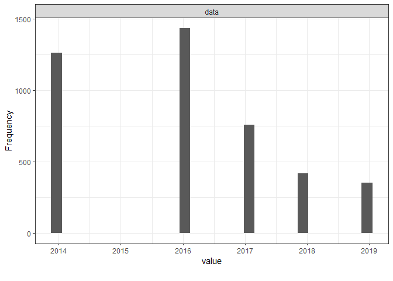
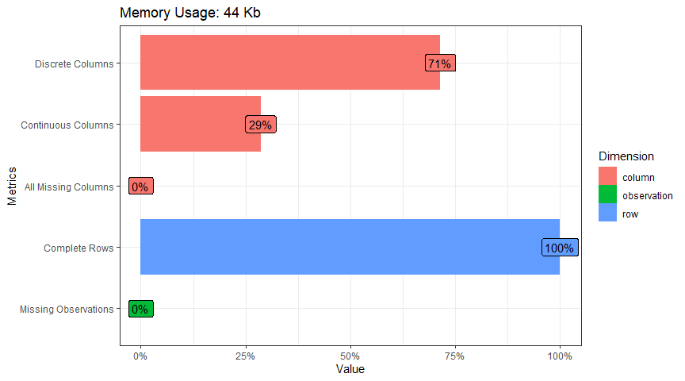
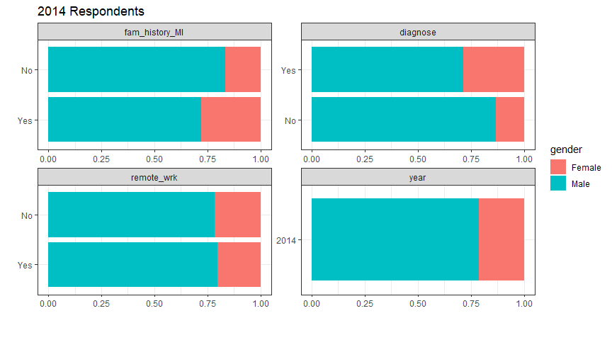
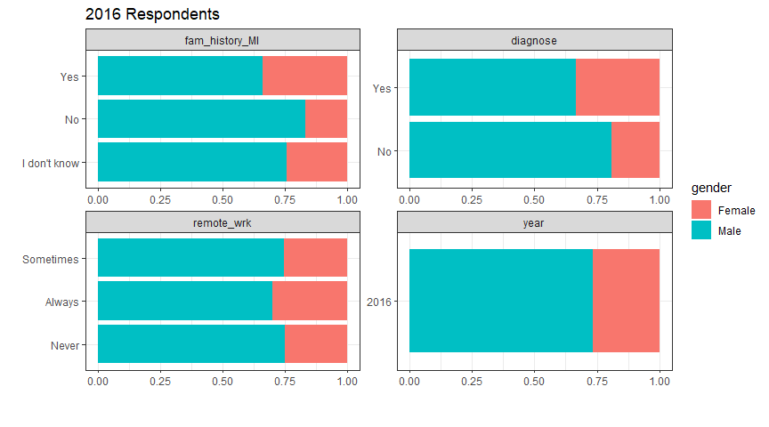
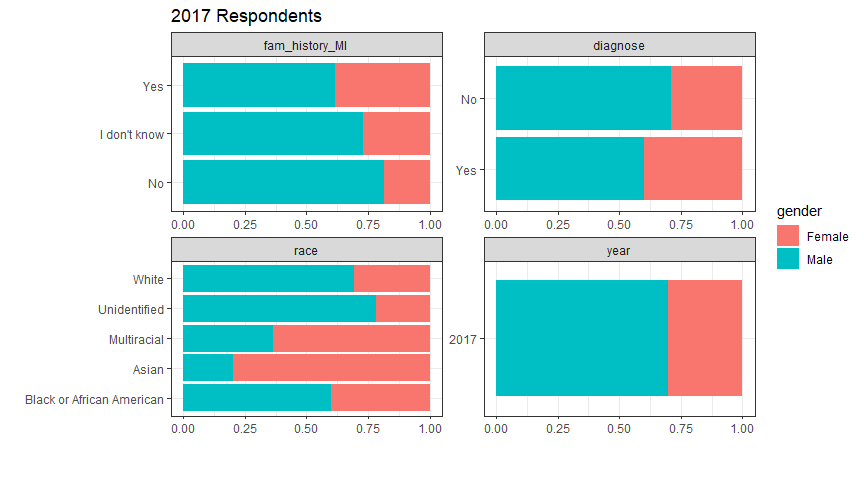
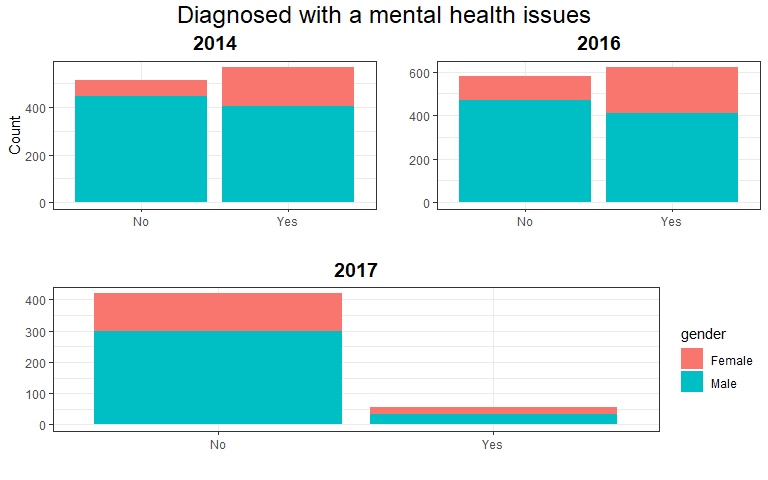
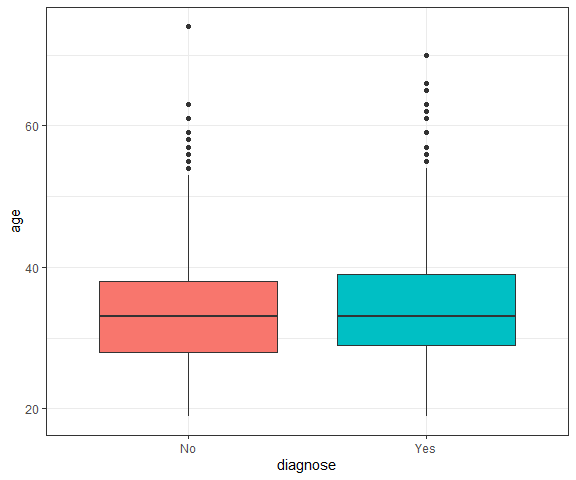
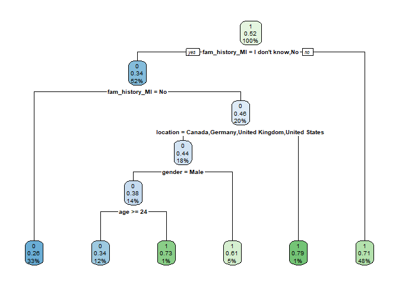
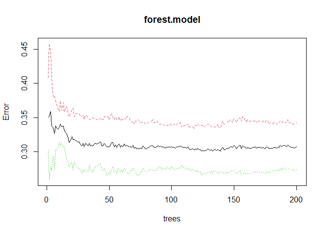
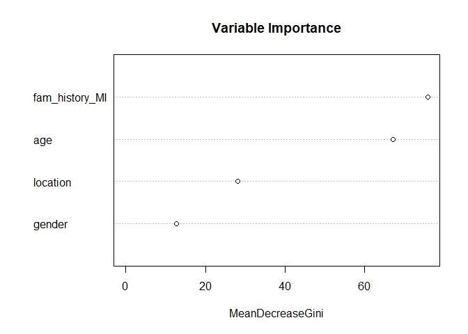

Mental Health
================
Fredrick Boshe
02/06/2021"

<br></br>

<center>

# Mental Health at the Workplace 🧠

</center>

Over the past year we have heard about just how much the pandemic has
exacerbated the mental health crisis around the world. According to
[research](https://www.kff.org/coronavirus-covid-19/issue-brief/the-implications-of-covid-19-for-mental-health-and-substance-use/),
an estimated 4 in 10 adults in the USA reported symptoms of anxiety or
depressive disorder during the pandemic. This figure is up from 1 in 10
adults in 2019.

The social isolation, community lockdown and grim newsfeeds filled with
pandemic casualties all paid a heavy toll on our mental health.This has
led to health authorities such as the CDC issuing guidelines on how to
[cope with
stress](https://www.cdc.gov/coronavirus/2019-ncov/daily-life-coping/managing-stress-anxiety.html).

With this in mind, i decided to analyze what were the mental health
trends **before** the pandemic, looking into in the tech industry which
has been know to have serious mental health issues for its employees.
Using data from [Open Source Mental Illness
(OSMI)](https://www.kaggle.com/anth7310/mental-health-in-the-tech-industry)
using survey data from years 2014, 2016, 2017, 2018 and 2019. The data
is on a database as it contains multiple tables. I will use SQLite
queries to extract the variables of interest and continue with R script
to analyze and visualize the relationships and patterns between the
indicators.

After downloading the database, load it/create a connection within an R
markdown chunk. You can declare the connection within the setup chunk
and you wont need to constantly declare it in every subsequent chunk.

``` r
conn<-dbConnect(SQLite(), "mental_health.sqlite")
tables <- dbListTables(conn)
```

Loading up the database connection we can see that the database has 3
tables, namely *Answer*, *Question*, *Survey*. The *question* table is
basically a *key* for indicators which you might find interesting to
analyze. Take a few minutes to query around the data you will realize
each year has different number of observations and respondents
(identified by the *UserID* column in the Answers table).

``` sql
--Preview the tables in the database
SELECT
    name,
    type
FROM sqlite_master
WHERE type IN ("table","view");
```

<div class="knitsql-table">

<table>
<caption>
3 records
</caption>
<thead>
<tr>
<th style="text-align:left;">
name
</th>
<th style="text-align:left;">
type
</th>
</tr>
</thead>
<tbody>
<tr>
<td style="text-align:left;">
Answer
</td>
<td style="text-align:left;">
table
</td>
</tr>
<tr>
<td style="text-align:left;">
Question
</td>
<td style="text-align:left;">
table
</td>
</tr>
<tr>
<td style="text-align:left;">
Survey
</td>
<td style="text-align:left;">
table
</td>
</tr>
</tbody>
</table>

</div>

Join the tables with an SQL query and save the full dataset. The tables
have (for some reason) been elongated. thankfully, we can pivot wider
the tables with a single R command. This will allow us to glimpse all
the indicators and select the ones most important for our analysis.

``` sql
---select and re-arrange columns
select UserID as id, SurveyID as year, questiontext as question, AnswerText as answer 
FROM Answer as A
LEFT JOIN Question as Q ON Q.questionid=A.QuestionID;
```

As you can see, this full dataset would have 107 variables! Clearly we
have no intention of analyzing all variable. We shall subset the
variables of interest.

The indicators of interest for this analysis are: 1. Age 2. Gender 3.
Location 4. Remote work 5. Family history of mental illness 6.
Respondent diagnosis of mental illness 7. Race

``` sql
--You can preview the available indicators per survey year (e.g. the variables for 2016)
select Q.questiontext
from Question as Q
Left join Answer as A on A.QuestionID = Q.questionid
Where A.SurveyID=2016
group by questiontext;
```

<div class="knitsql-table">

<table>
<caption>
Displaying records 1 - 10
</caption>
<thead>
<tr>
<th style="text-align:left;">
questiontext
</th>
</tr>
</thead>
<tbody>
<tr>
<td style="text-align:left;">
Are you self-employed?
</td>
</tr>
<tr>
<td style="text-align:left;">
Did you feel that your previous employers took mental health as
seriously as physical health?
</td>
</tr>
<tr>
<td style="text-align:left;">
Did you hear of or observe negative consequences for co-workers with
mental health issues in your previous workplaces?
</td>
</tr>
<tr>
<td style="text-align:left;">
Did your previous employers ever formally discuss mental health (as part
of a wellness campaign or other official communication)?
</td>
</tr>
<tr>
<td style="text-align:left;">
Did your previous employers provide resources to learn more about mental
health disorders and how to seek help?
</td>
</tr>
<tr>
<td style="text-align:left;">
Do you believe your productivity is ever affected by a mental health
issue?
</td>
</tr>
<tr>
<td style="text-align:left;">
Do you currently have a mental health disorder?
</td>
</tr>
<tr>
<td style="text-align:left;">
Do you feel that being identified as a person with a mental health issue
would hurt your career?
</td>
</tr>
<tr>
<td style="text-align:left;">
Do you feel that your employer takes mental health as seriously as
physical health?
</td>
</tr>
<tr>
<td style="text-align:left;">
Do you have a family history of mental illness?
</td>
</tr>
</tbody>
</table>

</div>



We shall pick 3 years that had the most respondents, that is 2014, 2016
and 2017. This will help smooth things along the way with manageable
datasets. I will query out the 3 distinct tables, with the identified
indicators of interest. The reason for this is that each year,
respondents did not answer the same questions all around.

``` sql
---Subset a 2014 dataframe with variables of interest
select A.AnswerText as answer, A.SurveyID as year, A.UserID,
       Q.questiontext as question
from Answer as A
LEFT JOIN Question as Q ON Q.questionid=A.QuestionID
WHERE A.SurveyID=2014
AND (Q.questionid==1 OR Q.questionid==2 OR Q.questionid==3 
OR Q.questionid==6 OR Q.questionid==7 OR Q.questionid==93);
```

``` sql
---Subset a 2016 dataframe with variables of interest
select A.AnswerText as answer, A.SurveyID as year, A.UserID,
       Q.questiontext as question
from Answer as A
LEFT JOIN Question as Q ON Q.questionid=A.QuestionID
WHERE A.SurveyID=2016
AND (Q.questionid==1 OR Q.questionid==2 OR Q.questionid==3 
OR Q.questionid==6 OR Q.questionid==34 OR Q.questionid==117 OR Q.questionid==118);
```

``` sql
---Subset a 2017 dataframe with variables of interest
select A.AnswerText as answer, A.SurveyID as year, A.UserID,
       Q.questiontext as question
from Answer as A
LEFT JOIN Question as Q ON Q.questionid=A.QuestionID
WHERE A.SurveyID=2017
AND (Q.questionid==1 OR Q.questionid==2 OR Q.questionid==3 
OR Q.questionid==6 OR Q.questionid==78 OR Q.questionid==89);
```

A quick glance shows how each year there some questions that are not
found in another year. Plus the number of respondents is not consistent
across the years. It is better to subset each year as a unique dataset.

### Data Cleaning

``` r
#Pivot the columns longer and rename them
df.2014<-df.2014%>%
    pivot_wider(names_from = question,
                values_from = answer)

df.2014<-df.2014%>%
    rename(age=`What is your age?`,
           location=`What country do you live in?`,
           gender=`What is your gender?`,
           fam_history_MI=`Do you have a family history of mental illness?`,
           diagnose=`Have you ever sought treatment for a mental health disorder from a mental health professional?`,
           remote_wrk=`Do you work remotely (outside of an office) at least 50% of the time?`,
           id=UserID)


df.2016<-df.2016%>%
    pivot_wider(names_from = question,
                values_from = answer)

df.2016<-df.2016%>%
    rename(age=`What is your age?`,
           location=`What country do you live in?`,
           gender=`What is your gender?`,
           fam_history_MI=`Do you have a family history of mental illness?`,
           diagnose=`Have you ever been diagnosed with a mental health disorder?`,
           remote_wrk=`Do you work remotely?`,
           id=UserID,
           position=`Which of the following best describes your work position?`)

df.2017<-df.2017%>%
    pivot_wider(names_from = question,
                values_from = answer)

df.2017<-df.2017%>%
    rename(age=`What is your age?`,
           location=`What country do you live in?`,
           gender=`What is your gender?`,
           fam_history_MI=`Do you have a family history of mental illness?`,
           diagnose= `Are you openly identified at work as a person with a mental health issue?`,
           race=`What is your race?`,
           id=UserID)
```

After reshaping our data we see that the 2016 dataset has the most
respondents, 1,433 while the 2017 dataset has the fewest, 756. We can
also see that the only common indicators are age, gender and location
and family mental history. As the respondents differ across the years,
it would be unwise to combine the datasets using UserID. But we can
analyze each dataset individually and draw comparisons.

Next step is to manipulate the data and improve consistency. Some
indicators, such has race has text and numerical in the same column.

### Data Manipulation and Exploration

``` r
# 2014 dataset
# For consistency purposes, only keep those that identified as Male or Female
# Keep only locations with more than 20 observations in each of the survey years
country<-c("Australia", "Canada", "Germany", "Netherlands", 
           "United Kingdom", "United States")

#Transform categorical variables
df.2014<-df.2014%>%
  filter(location %in% country)%>%
  mutate(gender=as.factor(gender),
         diagnose=as.factor(diagnose),
         fam_history_MI=as.factor(fam_history_MI),
         remote_wrk=as.factor(remote_wrk),
         location=as.factor(location))%>%
  filter(gender=="Male"|gender=="Female")%>%
  mutate(diagnose= ifelse(diagnose==1, "Yes", "No"))

df.2014$id<-NULL
df.2014$age<-parse_number(df.2014$age)

# 2016 dataset
# Some of the columns are lists, unlist them
df.2016$age<-unlist(df.2016$age)
df.2016$gender<-unlist(df.2016$gender)
df.2016$location<-unlist(df.2016$location)
df.2016$fam_history_MI<-unlist(df.2016$fam_history_MI)
df.2016$diagnose<-unlist(df.2016$diagnose)
df.2016$remote_wrk<-unlist(df.2016$remote_wrk)

#Create country variable to match list of countries 
country<-c("Australia", "Canada", "Germany", "Netherlands", 
           "United Kingdom", "United States of America")

df.2016<-df.2016 %>%
  filter(gender=="Male"|gender=="Female")%>%
  filter(location %in% country)%>%
  mutate(location=ifelse(location=="United States of America", 
                         "United States", location))%>%
  mutate(gender=as.factor(gender),
         diagnose=as.factor(diagnose),
         fam_history_MI=as.factor(fam_history_MI),
         remote_wrk=as.factor(remote_wrk),
         location=as.factor(location))
df.2016$position<-NULL
df.2016$id<-NULL
df.2016$age<-parse_number(df.2016$age)

#There are some impossible values in the age column. Remove them
df.2016<-df.2016%>%
  filter(age<100 & age>16)


# 2017 dataset
# This dataset has a Race column but it needs recoding
df.2017<-df.2017 %>%
  filter(gender=="Male"|gender=="Female")%>%
  filter(location %in% country)%>%
  mutate(race=ifelse(race=="-1", "Unidentified",
                     ifelse(race=="More than one of the above", "Multiracial",
                            ifelse(race=="I prefer not to answer", "Unidentified", race))))%>%
  mutate(diagnose= ifelse(diagnose==1, "Yes", "No"))%>%
  mutate(gender=as.factor(gender),
         diagnose=as.factor(diagnose),
         fam_history_MI=as.factor(fam_history_MI),
         location=as.factor(location),
         race=as.factor(race))

df.2017$id<-NULL
df.2017$age<-parse_number(df.2017$age)


#Explore data after cleaning
plot_intro(df.2014, ggtheme = theme_bw())
```



``` r
plot_bar(df.2014, maxcat = 5, by="gender", 
         ggtheme = theme_bw(), ncol = 2,
         title = "2014 Respondents")
```



``` r
plot_bar(df.2016, maxcat = 5, by="gender", 
         ggtheme = theme_bw(), ncol = 2,
         title = "2016 Respondents")
```



``` r
plot_bar(df.2017, maxcat = 5, by="gender", 
         ggtheme = theme_bw(), ncol = 2,
         title = "2017 Respondents")
```


**Exploratory Statistics:** The dataset does not contain any missing
values, which makes our easier. It would seem for each survey year, 7
out of 10 respondents are male. When it comes to mental health
diagnosis, interestingly, a higher share of women have been diagnosed
with mental health issues as compared not being diagnosed. This trend is
consistent in all 3 survey years.

### Factor Selection

``` r
#2014
chi.square <- vector()
p.value <- vector()
cateVar <- df.2014 %>% 
  dplyr::select(-diagnose) %>% 
  keep(is.factor)

for (i in 1:length(cateVar)) {
 p.value[i] <- round(chisq.test(df.2014$diagnose, unname(unlist(cateVar[i])), correct = FALSE)[3]$p.value, 3)
 chi.square[i] <- unname(chisq.test(df.2014$diagnose, unname(unlist(cateVar[i])), correct = FALSE)[1]$statistic)
}

chi_sqaure_test <- tibble(variable = names(cateVar)) %>% 
  add_column(chi.square = chi.square) %>% 
  add_column(p.value = p.value)
knitr::kable(chi_sqaure_test, caption = "Chi-square Test (2014)")%>% 
  kable_styling()
```

<table class="table" style="margin-left: auto; margin-right: auto;">
<caption>
Chi-square Test (2014)
</caption>
<thead>
<tr>
<th style="text-align:left;">
variable
</th>
<th style="text-align:right;">
chi.square
</th>
<th style="text-align:right;">
p.value
</th>
</tr>
</thead>
<tbody>
<tr>
<td style="text-align:left;">
gender
</td>
<td style="text-align:right;">
37.515665
</td>
<td style="text-align:right;">
0.000
</td>
</tr>
<tr>
<td style="text-align:left;">
location
</td>
<td style="text-align:right;">
7.425781
</td>
<td style="text-align:right;">
0.191
</td>
</tr>
<tr>
<td style="text-align:left;">
fam\_history\_MI
</td>
<td style="text-align:right;">
151.375002
</td>
<td style="text-align:right;">
0.000
</td>
</tr>
<tr>
<td style="text-align:left;">
remote\_wrk
</td>
<td style="text-align:right;">
0.798249
</td>
<td style="text-align:right;">
0.372
</td>
</tr>
</tbody>
</table>

``` r
#2016
chi.square <- vector()
p.value <- vector()
cateVar <- df.2016 %>% 
  dplyr::select(-diagnose) %>% 
  keep(is.factor)

for (i in 1:length(cateVar)) {
 p.value[i] <- round(chisq.test(df.2016$diagnose, unname(unlist(cateVar[i])), correct = FALSE)[3]$p.value, 3)
 chi.square[i] <- unname(chisq.test(df.2016$diagnose, unname(unlist(cateVar[i])), correct = FALSE)[1]$statistic)
}

chi_sqaure_test <- tibble(variable = names(cateVar)) %>% 
  add_column(chi.square = chi.square) %>% 
  add_column(p.value = p.value)
knitr::kable(chi_sqaure_test, caption = "Chi-square Test (2016)")%>% 
  kable_styling()
```

<table class="table" style="margin-left: auto; margin-right: auto;">
<caption>
Chi-square Test (2016)
</caption>
<thead>
<tr>
<th style="text-align:left;">
variable
</th>
<th style="text-align:right;">
chi.square
</th>
<th style="text-align:right;">
p.value
</th>
</tr>
</thead>
<tbody>
<tr>
<td style="text-align:left;">
gender
</td>
<td style="text-align:right;">
32.525143
</td>
<td style="text-align:right;">
0.000
</td>
</tr>
<tr>
<td style="text-align:left;">
location
</td>
<td style="text-align:right;">
29.189604
</td>
<td style="text-align:right;">
0.000
</td>
</tr>
<tr>
<td style="text-align:left;">
fam\_history\_MI
</td>
<td style="text-align:right;">
186.839854
</td>
<td style="text-align:right;">
0.000
</td>
</tr>
<tr>
<td style="text-align:left;">
remote\_wrk
</td>
<td style="text-align:right;">
4.119957
</td>
<td style="text-align:right;">
0.127
</td>
</tr>
</tbody>
</table>

``` r
#2017
chi.square <- vector()
p.value <- vector()
cateVar <- df.2017 %>% 
  dplyr::select(-diagnose) %>% 
  keep(is.factor)

for (i in 1:length(cateVar)) {
 p.value[i] <- round(chisq.test(df.2017$diagnose, unname(unlist(cateVar[i])), correct = FALSE)[3]$p.value, 3)
 chi.square[i] <- unname(chisq.test(df.2017$diagnose, unname(unlist(cateVar[i])), correct = FALSE)[1]$statistic)
}

chi_sqaure_test <- tibble(variable = names(cateVar)) %>% 
  add_column(chi.square = chi.square) %>% 
  add_column(p.value = p.value)
knitr::kable(chi_sqaure_test, caption = "Chi-square Test (2017)")%>% 
  kable_styling()
```

<table class="table" style="margin-left: auto; margin-right: auto;">
<caption>
Chi-square Test (2017)
</caption>
<thead>
<tr>
<th style="text-align:left;">
variable
</th>
<th style="text-align:right;">
chi.square
</th>
<th style="text-align:right;">
p.value
</th>
</tr>
</thead>
<tbody>
<tr>
<td style="text-align:left;">
gender
</td>
<td style="text-align:right;">
2.854531
</td>
<td style="text-align:right;">
0.091
</td>
</tr>
<tr>
<td style="text-align:left;">
location
</td>
<td style="text-align:right;">
10.198122
</td>
<td style="text-align:right;">
0.070
</td>
</tr>
<tr>
<td style="text-align:left;">
fam\_history\_MI
</td>
<td style="text-align:right;">
3.018338
</td>
<td style="text-align:right;">
0.221
</td>
</tr>
<tr>
<td style="text-align:left;">
race
</td>
<td style="text-align:right;">
1.834553
</td>
<td style="text-align:right;">
0.766
</td>
</tr>
</tbody>
</table>

Taking multiple Chi-square tests to check for independence of mental
health diagnosis on gender, family history, race and remote work we can
observe some relationships.

**Gender:** For the 2016 and 2017 surveys, we can reject the *null
hypothesis* of independence between gender and mental health diagnosis.
We fail to reject the null hypothesis for the survey year 2017.

**Family history:** For the 2016 and 2017 surveys, we can reject the
*null hypothesis* of independence between family history and mental
health diagnosis. We fail to reject the null hypothesis for the survey
year 2017.

**Remote work:** Only 2016 and 2017 surveys have information on working
remotely. As the p-values are above the threshold, we fail to reject the
*null hypothesis* of independence between working remotely and mental
health diagnosis. It would seem working remotely is not a good predictor
for the state of mental health for employees in this dataset.

**Race:** The 2017 dataset has information on race but after running the
chi-squared test, we fail to reject the *null hypothesis* of
independence between race and mental health diagnosis.

**Location:** This variable is significant and not independent in the
2014 dataset. Its p-values in 2016 and 2017 are too high meaning we fail
to reject the *null hypothesis* of independence between location and
mental health diagnosis.

``` r
p1<-df.2014%>%
  ggplot(aes(x=diagnose, fill=gender))+
  geom_histogram(stat = "count")+
  theme_bw()+
  labs(title = "2014",
       x="",
       y="Count")+
  theme(plot.title = element_text(face="bold", size=14, hjust = 0.5),
        legend.position = "none")

p2<-df.2016%>%
  ggplot(aes(x=diagnose, fill=gender))+
  geom_histogram(stat = "count")+
  theme_bw()+
  theme(legend.position = "none")+
  labs(title = "2016",
       x="",
       y="")+
  theme(plot.title = element_text(face="bold", size=14, hjust = 0.5),
        legend.position = "none")

p3<-df.2017%>%
  ggplot(aes(x=diagnose, fill=gender))+
  geom_histogram(stat = "count")+
  theme_bw()+
  labs(title = "2017",
       x="",
       y="")+
  theme(plot.title = element_text(face="bold", size=14, hjust = 0.5),
        axis.title.x = element_text(face="bold", size=14, hjust = 0.5, vjust = -0.8))

grid.arrange(arrangeGrob(p1,p2, ncol = 2),
             heights=c(3.5/4, 3.5/4), ncol=1,
             p3,nrow=2, top=textGrob("Diagnosed with a mental health issues",gp=gpar(cex=1.5,col="black")))
```



It would appear there is not significant relationship for our variables
of interest within the 2017 dataset. This can be explained by the very
low frequency of respondents that had a mental health diagnosis, as
compared to 2016 and 2014. The distribution of respondents is more
balanced in 2014 and 2016.

### Balance of Data

``` r
round(prop.table(table(df.2014$diagnose)),3)
```

    ## 
    ##    No   Yes 
    ## 0.476 0.524

``` r
round(prop.table(table(df.2016$diagnose)),3)
```

    ## 
    ##    No   Yes 
    ## 0.483 0.517

``` r
round(prop.table(table(df.2017$diagnose)),3)
```

    ## 
    ##    No   Yes 
    ## 0.884 0.116

``` r
rm(df.2014, df.2017)

df.2016$remote_wrk<-NULL
```

The 2014 and 2016 datasets have a good balance of data with the share of
respondents with a diagnose of mental health issues at 48% for both. But
the 2017 dataset is very unbalanced with just 12% with a diagnose of
mental health.

It is clear that due to its poor sampling, the 2017 data set would be of
very little value to us. Also the remote work variable has little to not
relationship to the mental health of workers. Therefore the 2017 dataset
was removed.

As *location* was only significant in the 2016 dataset, it would be ill
advised to combine the 2016 and 2014 datasets. The are to be analyzed
separately. I decided to remain with the 2016 dataset as it has more
observations.

## Model

I primarily used binary classifiers to try and model the predictors
against the state of a respondent having mental health issues or not. A
comparison of **Logistic Regression**, **Decision Tree** and **Random
Forest** was done at the end to select the best model.

### Normality of Data

``` r
#Test normality of age 
shapiro.test(df.2016$age)
```

    ## 
    ##  Shapiro-Wilk normality test
    ## 
    ## data:  df.2016$age
    ## W = 0.94888, p-value < 2.2e-16

``` r
#Wilcox test to see if there is a significant difference in Age between people diagnosed with mental health issues.
wilcox.test(age ~ diagnose, data = df.2016,
                   exact = FALSE)
```

    ## 
    ##  Wilcoxon rank sum test with continuity correction
    ## 
    ## data:  age by diagnose
    ## W = 169985, p-value = 0.1123
    ## alternative hypothesis: true location shift is not equal to 0

``` r
df.2016%>%ggplot(aes(x=diagnose, y=age, fill=diagnose))+
  geom_boxplot()+
  theme_bw()+
  theme(legend.position = "none")
```



``` r
#We can remove the year column and recode the diagnose column
df.2016$year<-NULL
df.2016<-df.2016%>%
  mutate(diagnose=ifelse(diagnose=="Yes",1,0))
df.2016$diagnose<-as.factor(df.2016$diagnose)
```

The data deviates significantly from a normal distribution as the
**p-value** from Shapiro’s test is below the significance level alpha =
0.05.

As the **p-value** of the wilcox test is larger than the significance
level alpha = 0.05, we can conclude that there is no significant
difference in age between those diagnosed with mental health issues and
those not.

### Split Data

``` r
#split data
set.seed(4)
index<- createDataPartition(df.2016$diagnose,p=0.8,list=FALSE)
training<- df.2016[index,]
testing<- df.2016[-index,]

#Check split
round(prop.table(table(df.2016$diagnose)),3)
```

    ## 
    ##     0     1 
    ## 0.483 0.517

``` r
round(prop.table(table(training$diagnose)),3)
```

    ## 
    ##     0     1 
    ## 0.483 0.517

``` r
round(prop.table(table(testing$diagnose)),3)
```

    ## 
    ##     0     1 
    ## 0.481 0.519

### Logistic Regression

``` r
## Train the model
logit.mod <- glm(diagnose~., family = binomial(link = 'logit'), 
                 data = training)

## Look at the result
summ(logit.mod)
```

<table class="table table-striped table-hover table-condensed table-responsive" style="width: auto !important; margin-left: auto; margin-right: auto;">
<tbody>
<tr>
<td style="text-align:left;font-weight: bold;">
Observations
</td>
<td style="text-align:right;">
960
</td>
</tr>
<tr>
<td style="text-align:left;font-weight: bold;">
Dependent variable
</td>
<td style="text-align:right;">
diagnose
</td>
</tr>
<tr>
<td style="text-align:left;font-weight: bold;">
Type
</td>
<td style="text-align:right;">
Generalized linear model
</td>
</tr>
<tr>
<td style="text-align:left;font-weight: bold;">
Family
</td>
<td style="text-align:right;">
binomial
</td>
</tr>
<tr>
<td style="text-align:left;font-weight: bold;">
Link
</td>
<td style="text-align:right;">
logit
</td>
</tr>
</tbody>
</table>
<table class="table table-striped table-hover table-condensed table-responsive" style="width: auto !important; margin-left: auto; margin-right: auto;">
<tbody>
<tr>
<td style="text-align:left;font-weight: bold;">
χ²(9)
</td>
<td style="text-align:right;">
184.81
</td>
</tr>
<tr>
<td style="text-align:left;font-weight: bold;">
Pseudo-R² (Cragg-Uhler)
</td>
<td style="text-align:right;">
0.23
</td>
</tr>
<tr>
<td style="text-align:left;font-weight: bold;">
Pseudo-R² (McFadden)
</td>
<td style="text-align:right;">
0.14
</td>
</tr>
<tr>
<td style="text-align:left;font-weight: bold;">
AIC
</td>
<td style="text-align:right;">
1164.97
</td>
</tr>
<tr>
<td style="text-align:left;font-weight: bold;">
BIC
</td>
<td style="text-align:right;">
1213.64
</td>
</tr>
</tbody>
</table>
<table class="table table-striped table-hover table-condensed table-responsive" style="width: auto !important; margin-left: auto; margin-right: auto;border-bottom: 0;">
<thead>
<tr>
<th style="text-align:left;">
</th>
<th style="text-align:right;">
Est.
</th>
<th style="text-align:right;">
S.E.
</th>
<th style="text-align:right;">
z val.
</th>
<th style="text-align:right;">
p
</th>
</tr>
</thead>
<tbody>
<tr>
<td style="text-align:left;font-weight: bold;">
(Intercept)
</td>
<td style="text-align:right;">
0.78
</td>
<td style="text-align:right;">
0.58
</td>
<td style="text-align:right;">
1.35
</td>
<td style="text-align:right;">
0.18
</td>
</tr>
<tr>
<td style="text-align:left;font-weight: bold;">
age
</td>
<td style="text-align:right;">
0.01
</td>
<td style="text-align:right;">
0.01
</td>
<td style="text-align:right;">
1.32
</td>
<td style="text-align:right;">
0.19
</td>
</tr>
<tr>
<td style="text-align:left;font-weight: bold;">
genderMale
</td>
<td style="text-align:right;">
-0.58
</td>
<td style="text-align:right;">
0.17
</td>
<td style="text-align:right;">
-3.46
</td>
<td style="text-align:right;">
0.00
</td>
</tr>
<tr>
<td style="text-align:left;font-weight: bold;">
locationCanada
</td>
<td style="text-align:right;">
-1.22
</td>
<td style="text-align:right;">
0.53
</td>
<td style="text-align:right;">
-2.29
</td>
<td style="text-align:right;">
0.02
</td>
</tr>
<tr>
<td style="text-align:left;font-weight: bold;">
locationGermany
</td>
<td style="text-align:right;">
-1.23
</td>
<td style="text-align:right;">
0.55
</td>
<td style="text-align:right;">
-2.23
</td>
<td style="text-align:right;">
0.03
</td>
</tr>
<tr>
<td style="text-align:left;font-weight: bold;">
locationNetherlands
</td>
<td style="text-align:right;">
-0.60
</td>
<td style="text-align:right;">
0.57
</td>
<td style="text-align:right;">
-1.05
</td>
<td style="text-align:right;">
0.30
</td>
</tr>
<tr>
<td style="text-align:left;font-weight: bold;">
locationUnited Kingdom
</td>
<td style="text-align:right;">
-1.11
</td>
<td style="text-align:right;">
0.48
</td>
<td style="text-align:right;">
-2.30
</td>
<td style="text-align:right;">
0.02
</td>
</tr>
<tr>
<td style="text-align:left;font-weight: bold;">
locationUnited States
</td>
<td style="text-align:right;">
-0.81
</td>
<td style="text-align:right;">
0.45
</td>
<td style="text-align:right;">
-1.79
</td>
<td style="text-align:right;">
0.07
</td>
</tr>
<tr>
<td style="text-align:left;font-weight: bold;">
fam\_history\_MINo
</td>
<td style="text-align:right;">
-0.88
</td>
<td style="text-align:right;">
0.20
</td>
<td style="text-align:right;">
-4.45
</td>
<td style="text-align:right;">
0.00
</td>
</tr>
<tr>
<td style="text-align:left;font-weight: bold;">
fam\_history\_MIYes
</td>
<td style="text-align:right;">
1.01
</td>
<td style="text-align:right;">
0.18
</td>
<td style="text-align:right;">
5.55
</td>
<td style="text-align:right;">
0.00
</td>
</tr>
</tbody>
<tfoot>
<tr>
<td style="padding: 0; " colspan="100%">
<sup></sup> Standard errors: MLE
</td>
</tr>
</tfoot>
</table>

``` r
## Predict the mental health against our test data
logit.pred.prob <- predict(logit.mod, testing, type = 'response')
logit.pred <- as.factor(ifelse(logit.pred.prob > 0.5, 1, 0))
head(testing, 3)
```

    ## # A tibble: 3 x 5
    ##     age gender location      fam_history_MI diagnose
    ##   <dbl> <fct>  <fct>         <fct>          <fct>   
    ## 1    34 Male   United States Yes            1       
    ## 2    30 Female United States Yes            1       
    ## 3    26 Male   United States Yes            0

``` r
head(logit.pred, 3)
```

    ## 1 2 3 
    ## 1 1 1 
    ## Levels: 0 1

``` r
#Feature analysis
knitr::kable(round(anova(logit.mod, test="Chisq"),3), 
             caption = "Likelihood Ratio test")%>% 
  kable_styling()
```

<table class="table" style="margin-left: auto; margin-right: auto;">
<caption>
Likelihood Ratio test
</caption>
<thead>
<tr>
<th style="text-align:left;">
</th>
<th style="text-align:right;">
Df
</th>
<th style="text-align:right;">
Deviance
</th>
<th style="text-align:right;">
Resid. Df
</th>
<th style="text-align:right;">
Resid. Dev
</th>
<th style="text-align:right;">
Pr(&gt;Chi)
</th>
</tr>
</thead>
<tbody>
<tr>
<td style="text-align:left;">
NULL
</td>
<td style="text-align:right;">
NA
</td>
<td style="text-align:right;">
NA
</td>
<td style="text-align:right;">
959
</td>
<td style="text-align:right;">
1329.776
</td>
<td style="text-align:right;">
NA
</td>
</tr>
<tr>
<td style="text-align:left;">
age
</td>
<td style="text-align:right;">
1
</td>
<td style="text-align:right;">
1.010
</td>
<td style="text-align:right;">
958
</td>
<td style="text-align:right;">
1328.766
</td>
<td style="text-align:right;">
0.315
</td>
</tr>
<tr>
<td style="text-align:left;">
gender
</td>
<td style="text-align:right;">
1
</td>
<td style="text-align:right;">
27.296
</td>
<td style="text-align:right;">
957
</td>
<td style="text-align:right;">
1301.470
</td>
<td style="text-align:right;">
0.000
</td>
</tr>
<tr>
<td style="text-align:left;">
location
</td>
<td style="text-align:right;">
5
</td>
<td style="text-align:right;">
15.639
</td>
<td style="text-align:right;">
952
</td>
<td style="text-align:right;">
1285.831
</td>
<td style="text-align:right;">
0.008
</td>
</tr>
<tr>
<td style="text-align:left;">
fam\_history\_MI
</td>
<td style="text-align:right;">
2
</td>
<td style="text-align:right;">
140.861
</td>
<td style="text-align:right;">
950
</td>
<td style="text-align:right;">
1144.970
</td>
<td style="text-align:right;">
0.000
</td>
</tr>
</tbody>
</table>

``` r
#Odd ratio
knitr::kable(round(exp(cbind(coef(logit.mod), confint.default(logit.mod))),3),
             caption = "Odds Ratio")%>% 
  kable_styling()
```

<table class="table" style="margin-left: auto; margin-right: auto;">
<caption>
Odds Ratio
</caption>
<thead>
<tr>
<th style="text-align:left;">
</th>
<th style="text-align:right;">
</th>
<th style="text-align:right;">
2.5 %
</th>
<th style="text-align:right;">
97.5 %
</th>
</tr>
</thead>
<tbody>
<tr>
<td style="text-align:left;">
(Intercept)
</td>
<td style="text-align:right;">
2.185
</td>
<td style="text-align:right;">
0.702
</td>
<td style="text-align:right;">
6.796
</td>
</tr>
<tr>
<td style="text-align:left;">
age
</td>
<td style="text-align:right;">
1.011
</td>
<td style="text-align:right;">
0.995
</td>
<td style="text-align:right;">
1.029
</td>
</tr>
<tr>
<td style="text-align:left;">
genderMale
</td>
<td style="text-align:right;">
0.562
</td>
<td style="text-align:right;">
0.405
</td>
<td style="text-align:right;">
0.778
</td>
</tr>
<tr>
<td style="text-align:left;">
locationCanada
</td>
<td style="text-align:right;">
0.295
</td>
<td style="text-align:right;">
0.104
</td>
<td style="text-align:right;">
0.837
</td>
</tr>
<tr>
<td style="text-align:left;">
locationGermany
</td>
<td style="text-align:right;">
0.292
</td>
<td style="text-align:right;">
0.099
</td>
<td style="text-align:right;">
0.863
</td>
</tr>
<tr>
<td style="text-align:left;">
locationNetherlands
</td>
<td style="text-align:right;">
0.548
</td>
<td style="text-align:right;">
0.178
</td>
<td style="text-align:right;">
1.690
</td>
</tr>
<tr>
<td style="text-align:left;">
locationUnited Kingdom
</td>
<td style="text-align:right;">
0.331
</td>
<td style="text-align:right;">
0.129
</td>
<td style="text-align:right;">
0.850
</td>
</tr>
<tr>
<td style="text-align:left;">
locationUnited States
</td>
<td style="text-align:right;">
0.443
</td>
<td style="text-align:right;">
0.182
</td>
<td style="text-align:right;">
1.079
</td>
</tr>
<tr>
<td style="text-align:left;">
fam\_history\_MINo
</td>
<td style="text-align:right;">
0.414
</td>
<td style="text-align:right;">
0.281
</td>
<td style="text-align:right;">
0.610
</td>
</tr>
<tr>
<td style="text-align:left;">
fam\_history\_MIYes
</td>
<td style="text-align:right;">
2.740
</td>
<td style="text-align:right;">
1.919
</td>
<td style="text-align:right;">
3.912
</td>
</tr>
</tbody>
</table>

``` r
# Evaluation Metrics
log.result <- confusionMatrix(data = logit.pred, testing$diagnose, 
                              positive = "1")
log.precision <- log.result$byClass['Pos Pred Value']
log.recall    <- log.result$byClass['Sensitivity']
log.F1        <- log.result$byClass['F1']

log.result
```

    ## Confusion Matrix and Statistics
    ## 
    ##           Reference
    ## Prediction  0  1
    ##          0 78 35
    ##          1 37 89
    ##                                           
    ##                Accuracy : 0.6987          
    ##                  95% CI : (0.6363, 0.7562)
    ##     No Information Rate : 0.5188          
    ##     P-Value [Acc > NIR] : 1.156e-08       
    ##                                           
    ##                   Kappa : 0.3963          
    ##                                           
    ##  Mcnemar's Test P-Value : 0.9062          
    ##                                           
    ##             Sensitivity : 0.7177          
    ##             Specificity : 0.6783          
    ##          Pos Pred Value : 0.7063          
    ##          Neg Pred Value : 0.6903          
    ##              Prevalence : 0.5188          
    ##          Detection Rate : 0.3724          
    ##    Detection Prevalence : 0.5272          
    ##       Balanced Accuracy : 0.6980          
    ##                                           
    ##        'Positive' Class : 1               
    ## 

From the logistic regression we can see the following predictors with
the lowest *p-values*:

**Age:** As age increases, respondents were slightly more likely to have
been diagnosed with mental health issues.

**Gender:** Men were less likely to have been diagnosed with mental
health issues as compared to women respondents.

**Family history:** People with a family history of mental health issues
are more likely to also be diagnosed with mental health issues.

A feature analysis shows that gender and family history are the
strongest predictors of mental health in the survey response. In fact,
an odds ratio analysis shows that if a respondent has a family history
of mental health issues, they are <span style="color: red;">**5
times**</span> more likely to also be diagnosed with mental health
issues. Meanwhile, if a respondent is male, they are <span
style="color: red;">**half**</span> as likely as women to have diagnosed
with mental health issues.

## Decision Tree

``` r
#Decision Tree
# Train model
tree.model <- rpart(diagnose~.,
                    data = training,
                    method = "class",
                    control = rpart.control(xval = 10))
# Plot
rpart.plot(tree.model)
```



``` r
# Evaluation metrics (Tree)
tree.pred      <- predict(tree.model, newdata = testing, type = "class")
tree.result    <- confusionMatrix(data = tree.pred, testing$diagnose)
tree.precision <- tree.result$byClass['Pos Pred Value']
tree.recall    <- tree.result$byClass['Sensitivity']
tree.F1        <- tree.result$byClass['F1']

tree.result
```

    ## Confusion Matrix and Statistics
    ## 
    ##           Reference
    ## Prediction  0  1
    ##          0 76 32
    ##          1 39 92
    ##                                           
    ##                Accuracy : 0.7029          
    ##                  95% CI : (0.6406, 0.7601)
    ##     No Information Rate : 0.5188          
    ##     P-Value [Acc > NIR] : 5.258e-09       
    ##                                           
    ##                   Kappa : 0.4037          
    ##                                           
    ##  Mcnemar's Test P-Value : 0.4764          
    ##                                           
    ##             Sensitivity : 0.6609          
    ##             Specificity : 0.7419          
    ##          Pos Pred Value : 0.7037          
    ##          Neg Pred Value : 0.7023          
    ##              Prevalence : 0.4812          
    ##          Detection Rate : 0.3180          
    ##    Detection Prevalence : 0.4519          
    ##       Balanced Accuracy : 0.7014          
    ##                                           
    ##        'Positive' Class : 0               
    ## 

## Random Forest

``` r
#Random Forest
#Train model
forest.model <- randomForest(diagnose~.,
                       data = training,
                       ntree=200,
                       type="classification")

# See error reduction with number of trees (not much gained beyond ~150 trees)
plot(forest.model)
```



``` r
# Look at the variable Importance from the random forest
varImpPlot(forest.model, sort = T, main="Variable Importance")
```



``` r
# Evaluation metrics
forest.pred      <- predict(forest.model, newdata = testing, type = "class")
forest.result    <- confusionMatrix(data = forest.pred, testing$diagnose)
forest.precision <- forest.result$byClass['Pos Pred Value']
forest.recall    <- forest.result$byClass['Sensitivity']
forest.F1        <- forest.result$byClass['F1']

forest.result
```

    ## Confusion Matrix and Statistics
    ## 
    ##           Reference
    ## Prediction  0  1
    ##          0 76 32
    ##          1 39 92
    ##                                           
    ##                Accuracy : 0.7029          
    ##                  95% CI : (0.6406, 0.7601)
    ##     No Information Rate : 0.5188          
    ##     P-Value [Acc > NIR] : 5.258e-09       
    ##                                           
    ##                   Kappa : 0.4037          
    ##                                           
    ##  Mcnemar's Test P-Value : 0.4764          
    ##                                           
    ##             Sensitivity : 0.6609          
    ##             Specificity : 0.7419          
    ##          Pos Pred Value : 0.7037          
    ##          Neg Pred Value : 0.7023          
    ##              Prevalence : 0.4812          
    ##          Detection Rate : 0.3180          
    ##    Detection Prevalence : 0.4519          
    ##       Balanced Accuracy : 0.7014          
    ##                                           
    ##        'Positive' Class : 0               
    ## 

### Compare Models

``` r
#Evaluate the 3 models
#Precision
log.precision
```

    ## Pos Pred Value 
    ##      0.7063492

``` r
tree.precision
```

    ## Pos Pred Value 
    ##      0.7037037

``` r
forest.precision
```

    ## Pos Pred Value 
    ##      0.7037037

``` r
#Recall
log.recall
```

    ## Sensitivity 
    ##   0.7177419

``` r
tree.recall
```

    ## Sensitivity 
    ##   0.6608696

``` r
forest.recall
```

    ## Sensitivity 
    ##   0.6608696

``` r
#F1 Score
log.F1
```

    ##    F1 
    ## 0.712

``` r
tree.F1
```

    ##        F1 
    ## 0.6816143

``` r
forest.F1
```

    ##        F1 
    ## 0.6816143

## Conclusion

Evaluating the best model, the logistic model has the highest
**Precision** and the second highest **recall** (sensitivity). Therefore
we can use the logistic regression to predict mental health status of a
respondent, granted we have their family mental health history, gender
and age.

Once done, do not forget to disconnect the database from your
environment.

``` r
dbDisconnect(conn)
```
