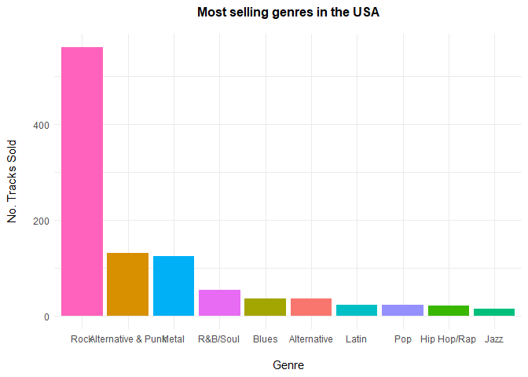
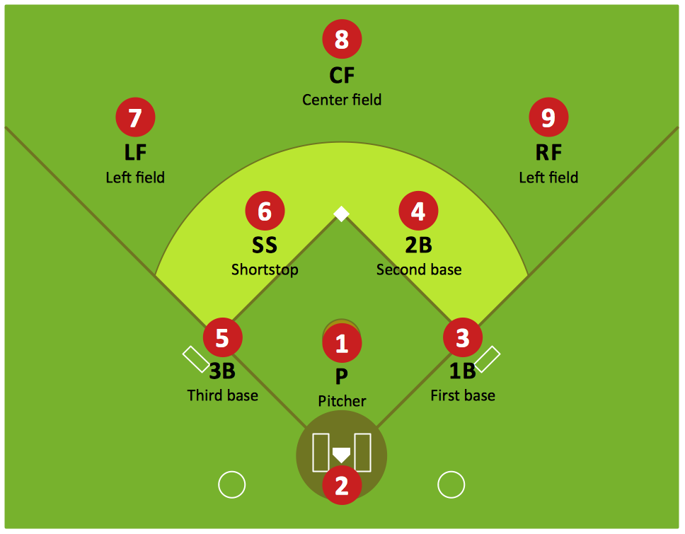

# SQL-fundamentals
Documentation of my Journey working with basic Sqlite via RSqlite in markdown. Projects get more detailed as they advance.

## Project One: Analyzing CIA factbook database
Load Packages and establish DB connection

``` r
library(RSQLite)
con<-dbConnect(SQLite(), "./factbook.db")
```

``` sql
--Preview the tables available
SELECT *
FROM sqlite_master
WHERE type='table';
```

2 records

</div>

``` sql
--First 5 rows from facts table
SELECT *
FROM facts
LIMIT 5;
```

<div class="knitsql-table">

| id | code | name        |    area | area\_land | area\_water | population | population\_growth | birth\_rate | death\_rate | migration\_rate | created\_at                | updated\_at                |
| :- | :--- | :---------- | ------: | ---------: | ----------: | ---------: | -----------------: | ----------: | ----------: | --------------: | :------------------------- | :------------------------- |
| 1  | af   | Afghanistan |  652230 |     652230 |           0 |   32564342 |               2.32 |       38.57 |       13.89 |            1.51 | 2015-11-01 13:19:49.461734 | 2015-11-01 13:19:49.461734 |
| 2  | al   | Albania     |   28748 |      27398 |        1350 |    3029278 |               0.30 |       12.92 |        6.58 |            3.30 | 2015-11-01 13:19:54.431082 | 2015-11-01 13:19:54.431082 |
| 3  | ag   | Algeria     | 2381741 |    2381741 |           0 |   39542166 |               1.84 |       23.67 |        4.31 |            0.92 | 2015-11-01 13:19:59.961286 | 2015-11-01 13:19:59.961286 |
| 4  | an   | Andorra     |     468 |        468 |           0 |      85580 |               0.12 |        8.13 |        6.96 |            0.00 | 2015-11-01 13:20:03.659945 | 2015-11-01 13:20:03.659945 |
| 5  | ao   | Angola      | 1246700 |    1246700 |           0 |   19625353 |               2.78 |       38.78 |       11.49 |            0.46 | 2015-11-01 13:20:08.625072 | 2015-11-01 13:20:08.625072 |

Displaying records 1 - 5

</div>

### **Min and Max populations states**

``` sql
SELECT MIN(population) as min_pop, MAX(population) as max_pop,
MIN(population_growth) as min_pop_g, MAX(population_growth) as max_pop_g
FROM facts;
```

<div class="knitsql-table">

| min\_pop |   max\_pop | min\_pop\_g | max\_pop\_g |
| -------: | ---------: | ----------: | ----------: |
|        0 | 7256490011 |           0 |        4.02 |

1 records

</div>

**Full solution workbook can be viewed [here](https://github.com/rickyboshe/SQL-fundamentals/blob/main/Guided-project.md)**
<br></br>
##  Project Two: Querying and Visualizing Chinook Music store
``` r
conn<-dbConnect(SQLite(), "chinook.db")
tables <- dbListTables(conn)
tables
```

    ##  [1] "album"          "artist"         "customer"       "employee"      
    ##  [5] "genre"          "invoice"        "invoice_line"   "media_type"    
    ##  [9] "playlist"       "playlist_track" "track"

``` sql
--Preview the tables in the database
SELECT
    name,
    type
FROM sqlite_master
WHERE type IN ("table","view");

--Most sold genres
SELECT g.name as genre_name, il.quantity as quantity_sold
FROM genre as g
LEFT JOIN track as t ON t.genre_id=g.genre_id
LEFT JOIN invoice_line as il ON il.track_id=t.track_id;
```

<div class="knitsql-table">

| name            | type  |
| :-------------- | :---- |
| album           | table |
| artist          | table |
| customer        | table |
| employee        | table |
| genre           | table |
| invoice         | table |
| invoice\_line   | table |
| media\_type     | table |
| playlist        | table |
| playlist\_track | table |

Displaying records 1 - 10

</div>

``` sql
---Most sold genres in the USA

WITH USA_tracks AS 
(SELECT il.quantity, il.track_id
FROM invoice_line as il
INNER JOIN invoice as i ON i.invoice_id=il.invoice_id
WHERE i.billing_country="USA")

SELECT g.name as genre_name, SUM(ut.quantity) as quantity_sold
FROM track as t
INNER JOIN USA_tracks as ut ON ut.track_id=t.track_id
INNER JOIN genre as g ON g.genre_id=t.genre_id
GROUP BY 1
ORDER BY 2 DESC
LIMIT 10;
```

``` r
genres_prop<-genres%>%
  drop_na(quantity_sold)%>%
  mutate(prop_quantity=quantity_sold/sum(quantity_sold))

plot1<-genres_prop%>%
  ggplot(aes(x=reorder(factor(genre_name), -quantity_sold), y=quantity_sold, fill=genre_name))+
  geom_col()+
  theme_minimal()+
  labs(title = "Most selling genres in the USA",
       y="No. Tracks Sold",
       x="Genre")+
  theme(plot.title = element_text(hjust = 0.5, size = 12, face="bold", 
                                  margin = margin(t = 0, r = 0, b = 15, l = 0)),
        axis.title.y = element_text(margin = margin(t = 0, r = 15, b = 0, l = 0)),
        axis.title.x = element_text(margin = margin(t = 15, r = 0, b = 0, l = 0)),
        legend.position="none")
plot1
```


Out of the four artists, it would be wise to select the artists
producing **punk**, **blues** and **Pop** as they are the three best
performing genres out of the four artists, in the USA.

**Full solution workbook can be viewed [here](https://github.com/rickyboshe/SQL-fundamentals/blob/main/Guided-project_Music-store.md)**

<br></br>
##  Project Three: Building a Baseball Database
This project is about utilizing the power of SQL to create a database
out of several Excel CSV files that exist individually. The goal is to
create a database that will house the several CSV files under one roof.
This includes creating a database Schema, linking the tables with
*primary keys* and *foreign keys*.

As usual, i shall be running my SQL queries on an R markdown book to
allow publishing queries online. A brief introduction on using SQL in R,
the packages and requirements can be found in another project i worked
on [earlier](https://rickyboshe.github.io/projects/Music.html).



## Leagues

According to Wikipedia, there are two major professional baseball
leagues, the American (AL) and National (NL). The data from retrosheets
contains a total of 6 different leagues. The additional leagues are
mostly defunct leagues from the old days, like the Federal league which
ended in 1915.

-   NL: [National League](https://en.wikipedia.org/wiki/National_League)
-   AL: [American League](https://en.wikipedia.org/wiki/American_League)
-   AA: [American
    Association](https://en.wikipedia.org/wiki/American_Association_%2819th_century%29)
-   FL: [Federal League](https://en.wikipedia.org/wiki/Federal_League)
-   PL: [Players
    League](https://en.wikipedia.org/wiki/Players%27_League)
-   UA: [Union
    Association](https://en.wikipedia.org/wiki/Union_Association)


For a **full solution (with code)** you can view it [here](https://github.com/rickyboshe/SQL-fundamentals/blob/main/Baseball.md)
